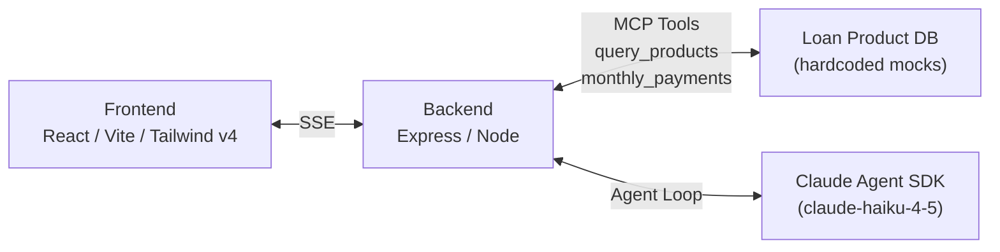

# GoodLeap Loan Product Assistant

An AI-powered chat assistant that helps contractors understand and explain GoodLeap loan products to homeowners. Contractors can ask questions about rates, terms, availability, and examples of monthly payment breakdowns. The assistant retrieves data from GoodLeap's internal data sources via tool calls and responds with compliant, factual answers.

## Quick Start

1. **Clone the repo**

2. **Add your Anthropic API key**

   Create `backend/.env.local` with your key:

   ```sh
   echo "ANTHROPIC_API_KEY=sk-ant-..." > backend/.env.local
   ```

   This file is gitignored. All other config has sensible defaults in `backend/.env`.

3. **Start the app**

   ```sh
   just app
   ```

   Or without `just`:

   ```sh
   docker compose up --build
   ```

4. **Open the UI** at [http://localhost:5173](http://localhost:5173)

## Architecture



- **Frontend** — React + TypeScript + Tailwind. Streams responses via Server Sent Events (SSE) over `fetch()`.
- **Backend** — Express + TypeScript. Runs a Claude agent loop using the [Claude Agent SDK](https://www.npmjs.com/package/@anthropic-ai/claude-agent-sdk) with custom MCP tools for querying loan products and calculating payments.
- **Agent** — Claude (Haiku 4.5) with tools scoped per-contractor. A compliance guardrail layer ensures responses include required disclosures or are blocked altogether if they contain non-compliant language.
- **Docker Compose** orchestrates both services with hot-reload via volume mounts.

## Prerequisites

- [Docker](https://docs.docker.com/get-docker/) (with Compose)
- [just](https://github.com/casey/just) command runner (optional — you can use `docker compose` directly)

## Environment Variables

| Variable | Location | Default | Description |
|---|---|---|---|
| `ANTHROPIC_API_KEY` | `backend/.env.local` | — | **Required.** Your Anthropic API key. |
| `MODEL` | `backend/.env` | `claude-haiku-4-5-20251001` | Claude model to use for the agent. |
| `MAX_AGENT_TURNS` | `backend/.env` | `10` | Max tool-use turns per request. |
| `PORT` | `backend/.env` | `3000` | Backend server port. |
